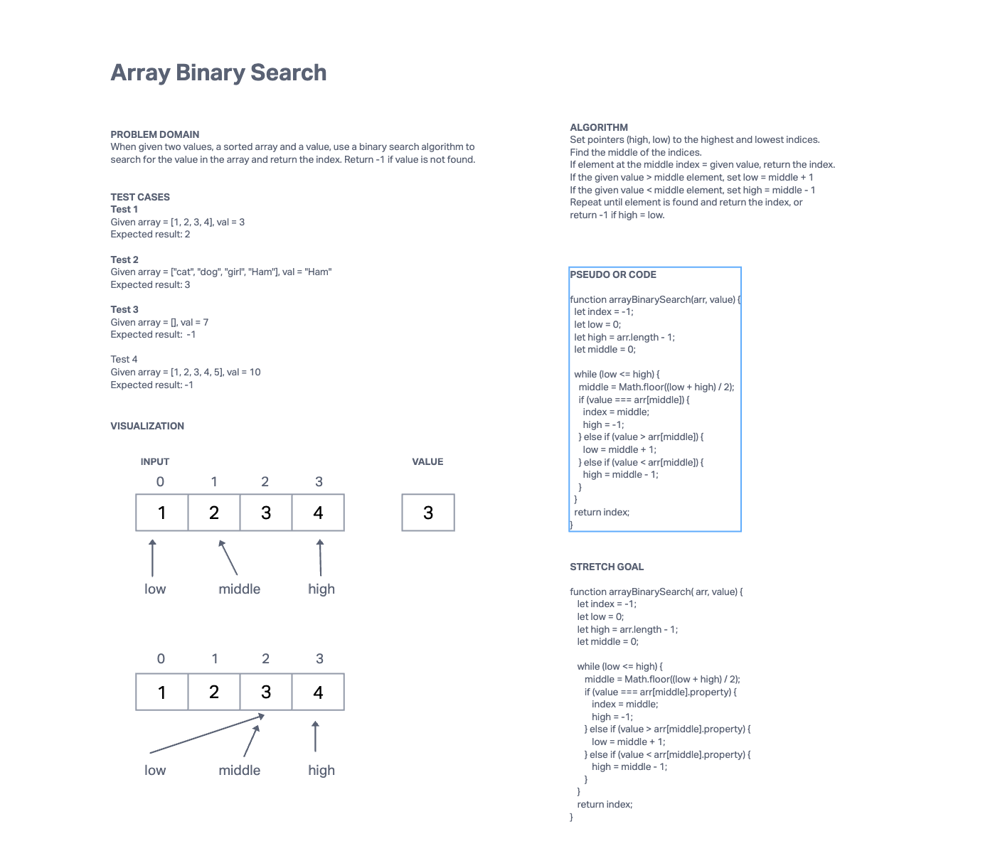

# Challenge Title
Array Binary Search

## Whiteboard Process

## Approach & Efficiency

I used a while loop to iterate through the array and perform the binary search. I had three pointers that I used in the loop, a low index pointer, a high index pointer, and a middle index pointer.

The runtime is O(log n) because each time the while loop iterates, it is halving the number of elements to search through.

The space is O(Constant) as I only keep a handful of temp variables in memory.

## Solution

* For my approach, I set pointers for the low and high indices.
* I then used a while loop to iterate through the array.
* If the middle (index between low and high pointers) had an element = given value, I return that index.
* Else if the value > middle element, I move the low pointer to 1 ahead of the middle index.
* Else if the value < middle element, I move the high pointer to 1 before the middle index.
* If the low and high pointers pass each other, the value is not in the array and I return -1.

Given sortedArray = [1, 2, 3, 4, 5]

    arrayBinarySearch(sortedArray, 5) = 4
    arrayBinarySearch(sortedArray, 22) = -1
