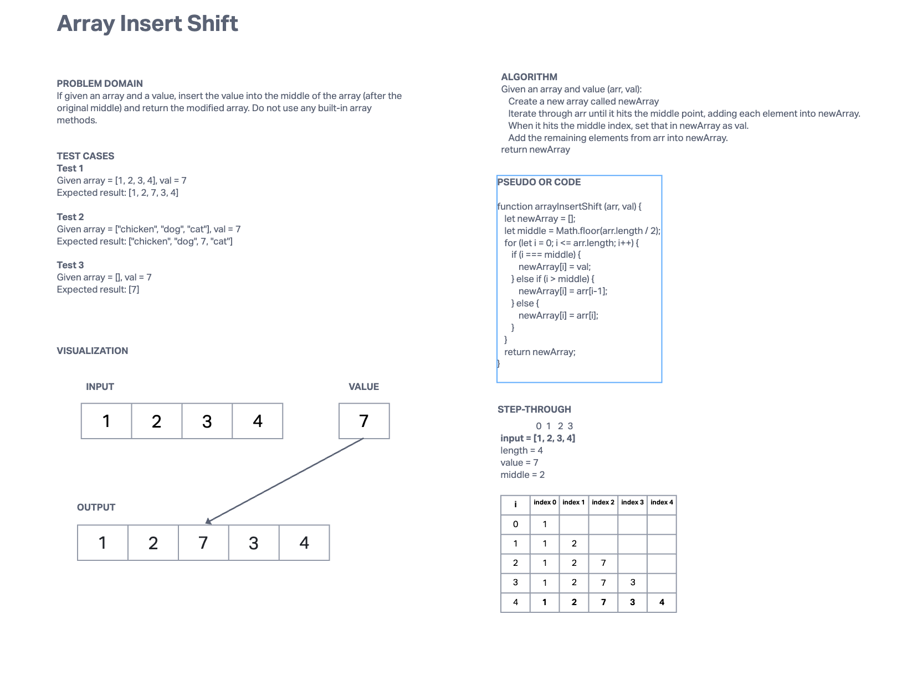

# Challenge Title
Array Insert Shift

## Whiteboard Process

## Approach & Efficiency
My solution used a for loop to go through the array and then if/else conditionals to determine when the
middle point was hit. I added all of the elements into a new array, with the new value inserted into the middle.

This operation has an O(N) runtime as it iterates through the whole length of the input array and takes O(N) space as a new array is created, proportional to the input array.

## Solution
    //example input [1, 2, 3, 4]
    //example value 7
    let newArray = [];
    let middle = Math.floor(arr.length / 2); // middle is index 2

    for (let i = 0; i <= arr.length; i++) {
      if (i === middle) {
        //when i = 2, we set index 2 as the given value, 7.
        //The new array at this point is  [1, 2, 7]
        newArray[i] = val;
      } else if (i > middle) {
        //when i passes the middle, we need to adjust the index to account
        //for the remaining array elements being shifted by one.
        newArray[i] = arr[i-1];
      } else {
        newArray[i] = arr[i];
      }
    }
    //At the end of this, newArray is [1, 2, 7, 3, 4]
    return newArray;
