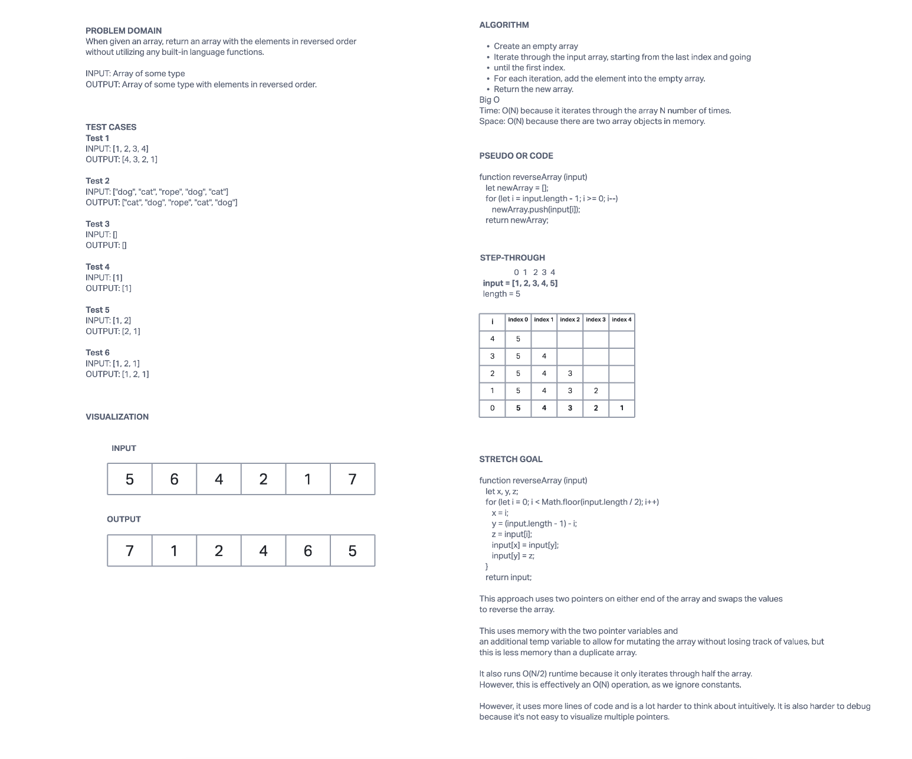

# Array-Reverse
## Description
Challenge for reversing an array.

[Solution link](./array-reverse.js)

## Whiteboard Process

## Approach & Efficiency
* Create an empty array
* Iterate through the input array, starting from the last index and going until the first index.
* For each iteration, add the element into the empty array.
* Return the new array.

Time: O(N) because it iterates through the array N number of times.

Space: O(N) because there are two array objects in memory.

This approach has decent performance and space usage, while also being very straightforward to read and understand.

## Solution

    function reverseArray (input)
      let newArray = [];

      for (let i = input.length - 1; i >= 0; i--)
        newArray.push(input[i]);
      return newArray;

**Test 1**

INPUT: [1, 2, 3, 4]

OUTPUT: [4, 3, 2, 1]

**Test 2**

INPUT: ["dog", "cat", "rope", "dog", "cat"]

OUTPUT: ["cat", "dog", "rope", "cat", "dog"]

**Test 3**

INPUT: []

OUTPUT: []

**Test 4**

INPUT: [1]

OUTPUT: [1]

**Test 5**

INPUT: [1, 2]

OUTPUT: [2, 1]

**Test 6**

INPUT: [1, 2, 1]

OUTPUT: [1, 2, 1]
