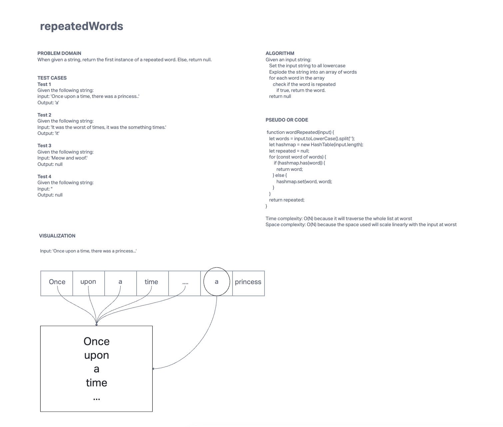

# repeatedWords

## Description
Implement a function that will return the first repeated word in a given string.

[Solution link](./repeated-word.js)

## Whiteboard Process

## Approach & Efficiency
Given an input string:

* Set the input string to all lowercase
* Explode the string into an array of words
  * for each word in the array
    * check if the word is repeated
    * if true, return the word.
* return null

This is O(N) in both time and space complexity as at worst, we have to iterate and store the entire string.
