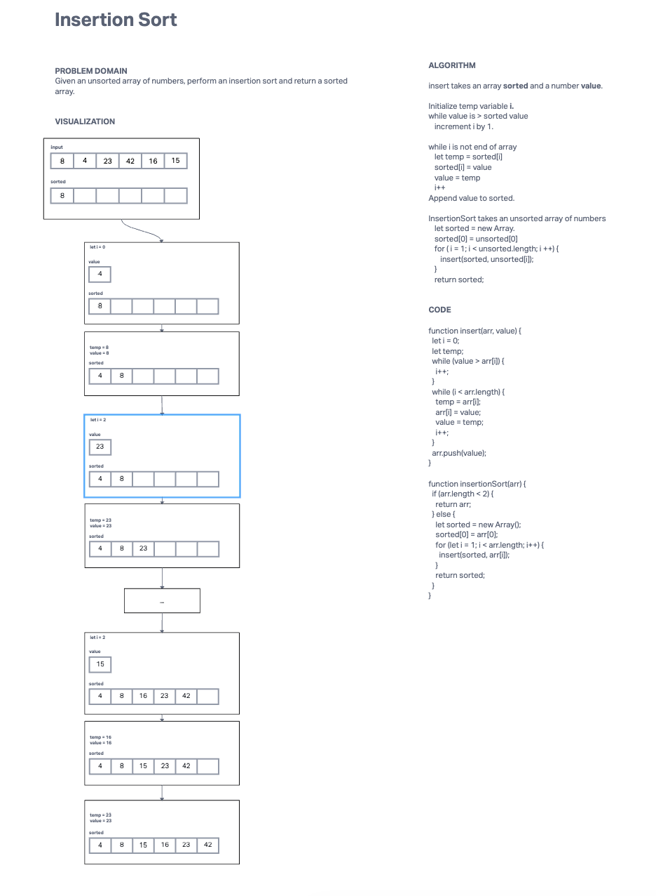

# Insertion Sort

## Description

Implement Insertion Sort for an unsorted array of numbers.
[Solution link](https://github.com/yd24/data-structures-and-algorithms/pull/34)

## Whiteboard Process

## Approach and Efficiency

When we are given an array of unsorted numbers:
* We create a new array that will hold the sorted values.
* We iterate through the unsorted array and for each value X:
  * We iterate through the array again until we find a value that is larger than the current value.
  * We insert X into the current position.
  * We move all values over one space.
* We return the sorted array.

In terms of time-complexity, the worst-case scenario is that we have to iterate through the entire array N number of times for all values (N). This means that our time-complexity is O(N)^2.

In terms of space-complexity, we have an additional array that is of the same size of the input N, so our space-complexity is O(N).
