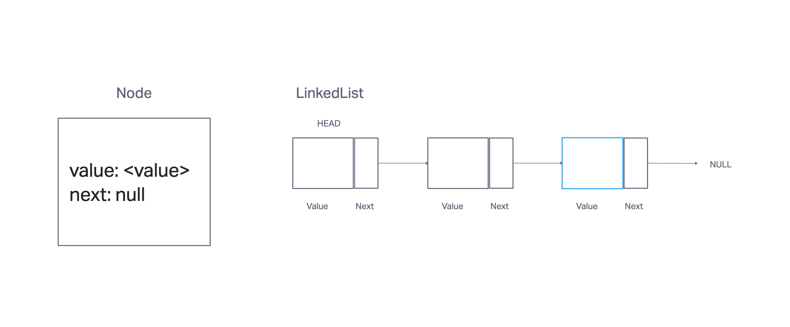
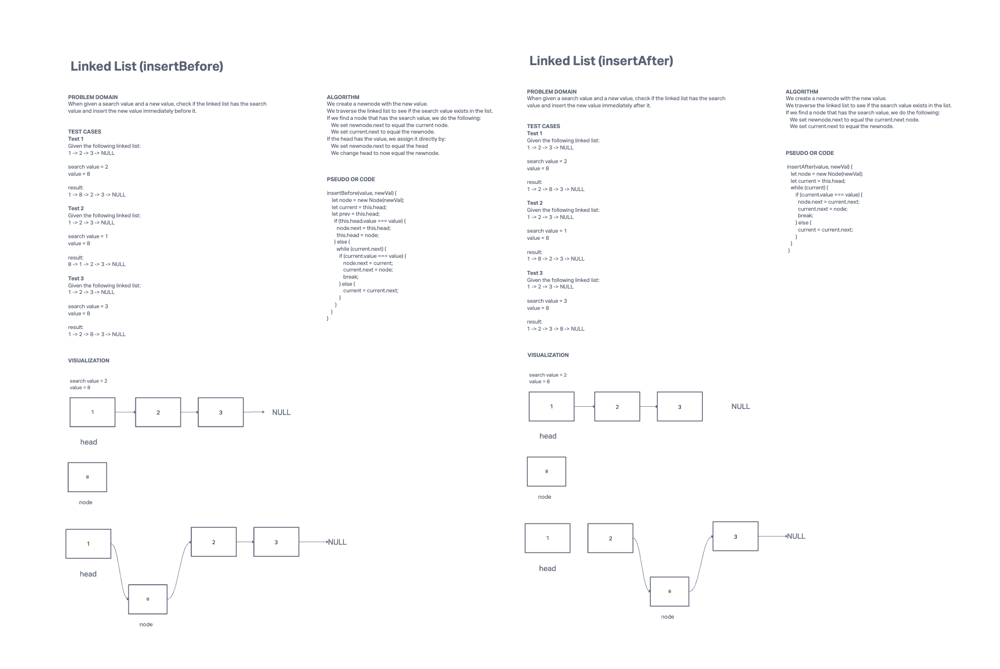
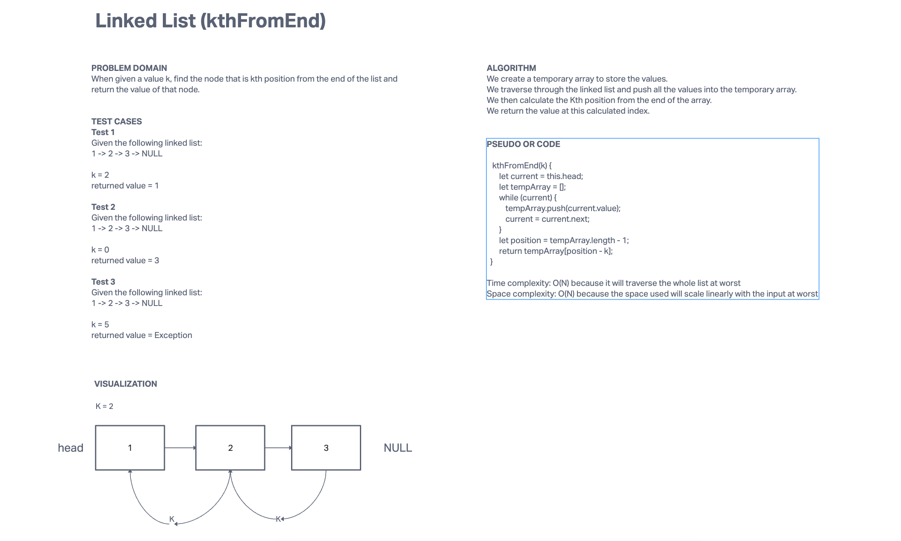
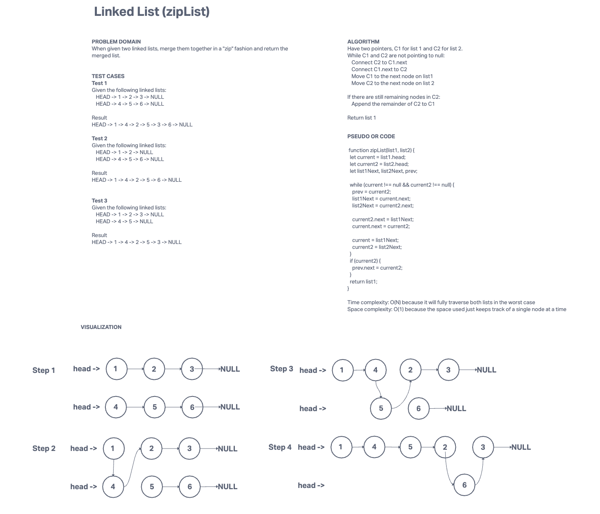

# Linked List
## Description
Implement a linked list

[Solution link](./index.js)
[Solution link 2](./zipList.js)

## Whiteboard Process

## Approach & Efficiency
* Have a Node object that has a value and a next value that points to null or another Node.
* Create a Linked List object that has a head that points to null or another Node.
* When inserting, use a while loop to start from head and continue down the next pointer until it hits null (end of the list). Then point the last next pointer to a new node with the inserted value.
* When checking if a Node exists in the Linked List with a value, traverse through the list and check the value of each node.
* When returning the Linked List in a string format, build a string while traversing through the list.

Inserting a node at the end will have O(N) time complexity because it must traverse through the entire list to find the end node.

Checking if a Node exists in the list and returning a string version of the list will also have O(N) time complexity for the same reason.

Our space complexity is O(1) because we only store a single value at a time that has a pointer to other parts of the list.

**insertBefore/insertAfter**
* O(N) time complexity because worst case is it'll have to traverse the whole list to insert the value.
* O(1) space complexity because worst case only has storing values in temporary nodes.

**kthFromEnd**
* O(N) time complexity because worst is it'll have to traverse the whole list.
* O(N) space complexity because we have to store an array the length of the linked list.

**zipList**
* O(N) time complexity because at worst it'll have to traverse both lists.
* O(1) space complexity because we only store one node at a time.
