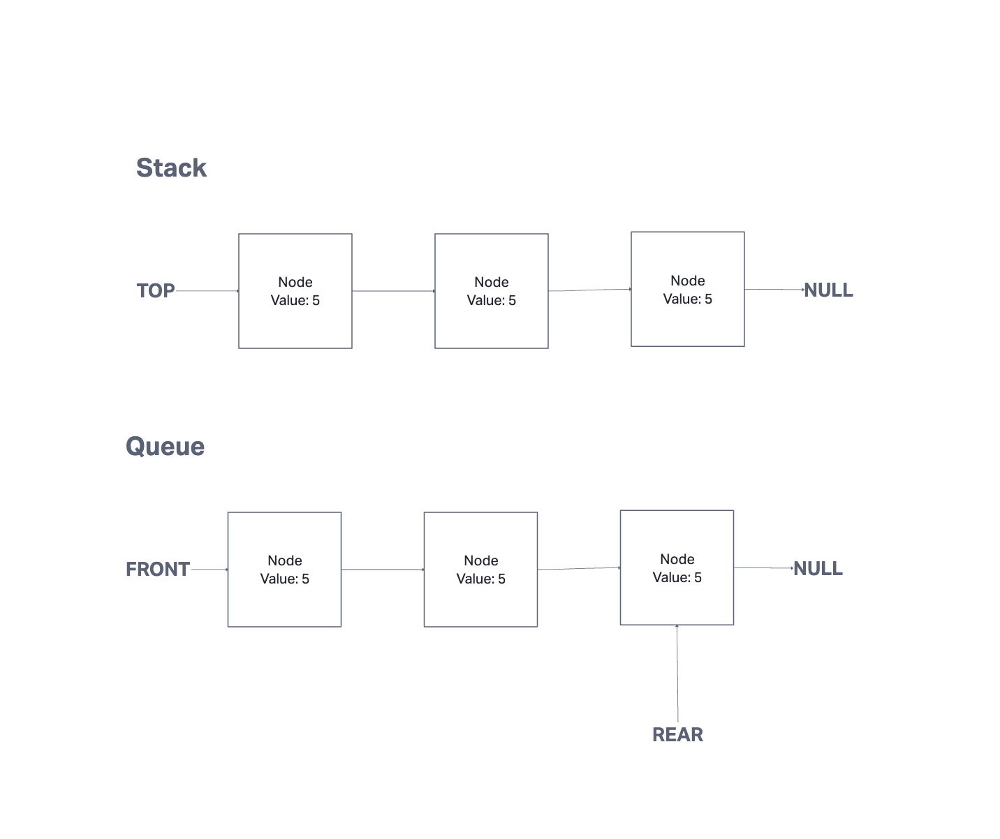
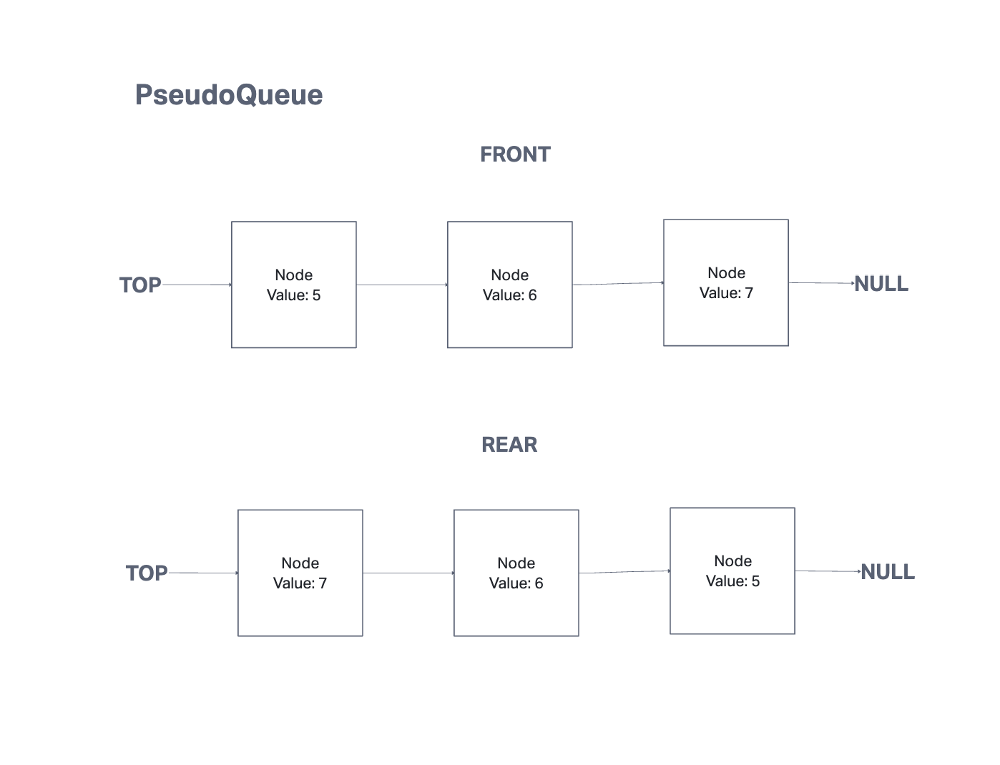

# Stack and Queue
## Description
Implement a stack, queue, and pseudoqueue.

[Solution link](./stack-and-queue.js)

## Whiteboard Process

## Approach & Efficiency

**Stack**
* Start with a pointer value called top that is set to a new Node.
* push(value)
  * Have top.next set to a new node with the value.
  * Reassign top to the new node.
* pop()
  * Return the value of the top node.
  * Reassign top to be top.next.
* peek()
  * Return the value of the top node.
* isEmpty()
  * Check if the top node is null.

**Queue**
* Start with a pointer value called front and a pointer value called rear, pointing to a node.
* enqueue(value)
  * If front is null, set front to the new node and update rear.
  * Set rear.next to the new node.
  * Update rear to the new node.
* dequeue()
  * Return the node at the front.
  * Update front to front.next.
* peek()
  * Return the value of the node at the front.
* isEmpty()
  * Return if the front is null.

**PseudoQueue**
* We use one Stack to hold the nodes from the "front" of the queue. Then to get the "rear", we use a second auxilary Stack.
* enqueue(value)
  * We simply push the value into the front stack.
* dequeue()
  * While the front stack is not empty:
    * We pop the node from the front stack and push it into the rear stack.
  * We pop the top node from the rear stack and return that value.
  * While the rear stack is not empty:
    * We pop the node from the rear stack and push it back into the front stack.

**Efficiency**

Both Stacks and Queues and their operations are O(1) time/space complexity as we never traverse the entire Stack/Queue. Instead, our operations are handled by variables with constant values that do not scale depending on the input.

For the PseudoQueue, the enqueue operation is O(1) time/space complexity as we simply push the value into a Stack. However, the dequeue operation is O(N) time complexity and O(1) space complexity. It is O(N) time complexity because we have to pop out the entire front and rear stacks, while it is O(1) space complexity because we are not storing any data, simply moving it from stack to stack.
