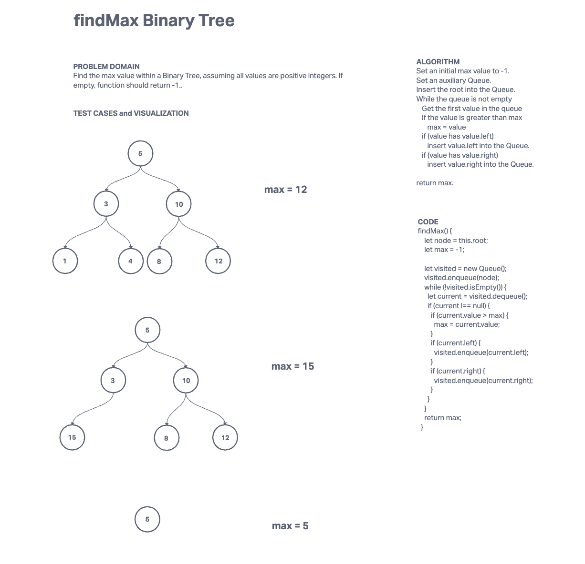

# Binary Trees
## Description
Implement a binary tree, binary search tree, and K-ary tree.

[Solution link](./trees.js)

## Whiteboard Process

## Approach & Efficiency

**Binary Tree**

* Traversal
  * Use a recursive function to travel through the tree.
  * Pre-order, we check the current value first then check the children.
  * In-order, we check the left child first, then the current node, then the right child.
  * Post-order, we check the children first then the current node.
  * Takes O(N) time complexity because we must iterate through the entire tree, no matter what. Takes O(N) space complexity because each node requires a recursive call on the callstack.

* findMax
  * Set an initial max value of -1.
  * We use breadth-first traversal to iterate through the node.
    * Insert a root node into a Queue and while the Queue is not empty
      * We take out the first node in the Queue.
      * If the node value is greater than max
        * max = node value
      * If the node has a left
        * Add node.left to the Queue.
      * If the node has a right
        * Add node.right to the Queue.
  * Return max.
  * Has O(N) time complexity as we traverse through the entire tree. O(N) space complexity as our Queue's size is dependent on the size of our input.

* breadthFirst
  * Insert a root node into a Queue and while the Queue is not empty
    * We take out the first node in the Queue.
    * We push the node's value into an array.
    * If the node value is greater than max
      * max = node value
    * If the node has a left
      * Add node.left to the Queue.
    * If the node has a right
      * Add node.right to the Queue.
  * Return array.
* Has O(N) time complexity as we traverse through the entire tree. O(N) space complexity as our Queue's size is dependent on the size of our input.

**Binary Search Tree**

* add
  * We take a root node and a value.
  * We then use a recursive function where we create a new node if the current node is null.
  * Else if the value is smaller than the current node value, we set the node.left equal to another recursive call of the function with (node.left, value).
  * Else if the value is larger than the current node value, we set the node.right equal to another recursive call of the function with (node.right, value).

* contains
  * We take a root node and a value.
  * If the node is null, it is empty and we return false.
  * If the value is larger than the node value, we return a recursive call (node.right, value).
  * If the value is smaller than the node value, we return a recursive call (node.left, value).
  * Else we return true.

Both of these take O(N) time complexity at worst as we will need to traverse through the whole tree. Both also take O(N) space complexity as a recursive call gets added to the callstack for each node.

**K-ary Tree**

* fizzBuzzTree
  * We check if the node value is divisible by 3.
    * If so, we change the value to 'Fizz'.
  * We check if the node value is divisible by 5.
    * If so, we change the value to 'Buzz'.
  * We check if the node value is divisible by 3 and 5.
    * If so, we change the value to 'FizzBuzz'.

  * We check if the node has any children.
    * If so, we iterate through the children.
      * For each child, we call the function again recursively.

  * We return a new K-ary tree made from the node.

This function takes O(N) time complexity because we are traversing through the entire tree once. It also takes O(N) space complexity because we are adding recursive calls to the call stack for each node.
