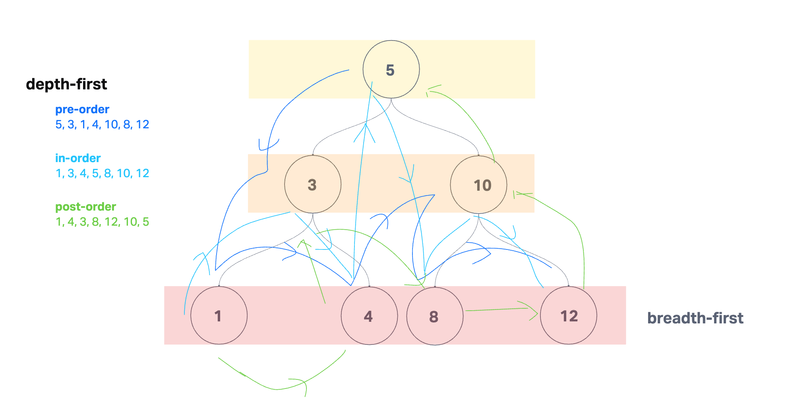

# Binary Trees
## Description
Implement a binary tree and a binary search tree.

[Solution link](./trees.js)

## Whiteboard Process

## Approach & Efficiency

**Binary Tree**

* Traversal
  * Use a recursive function to travel through the tree.
  * Pre-order, we check the current value first then check the children.
  * In-order, we check the left child first, then the current node, then the right child.
  * Post-order, we check the children first then the current node.
  * Takes O(N) time complexity because we must iterate through the entire tree, no matter what. Takes O(1) space complexity because we only store one Node variable at a time.

**Binary Search Tree**

* add
  * We take a root node and a value.
  * We then use a recursive function where we create a new node if the current node is null.
  * Else if the value is smaller than the current node value, we set the node.left equal to another recursive call of the function with (node.left, value).
  * Else if the value is larger than the current node value, we set the node.right equal to another recursive call of the function with (node.right, value).

* contains
  * We take a root node and a value.
  * If the node is null, it is empty and we return false.
  * If the value is larger than the node value, we return a recursive call (node.right, value).
  * If the value is smaller than the node value, we return a recursive call (node.left, value).
  * Else we return true.

Both of these take O(N) time complexity at worst as we will need to traverse through the whole tree. Both also take O(1) space complexity as we only look at one node at a time.
